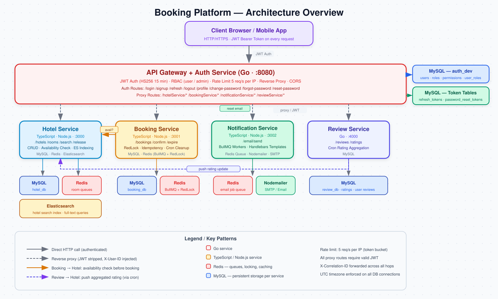
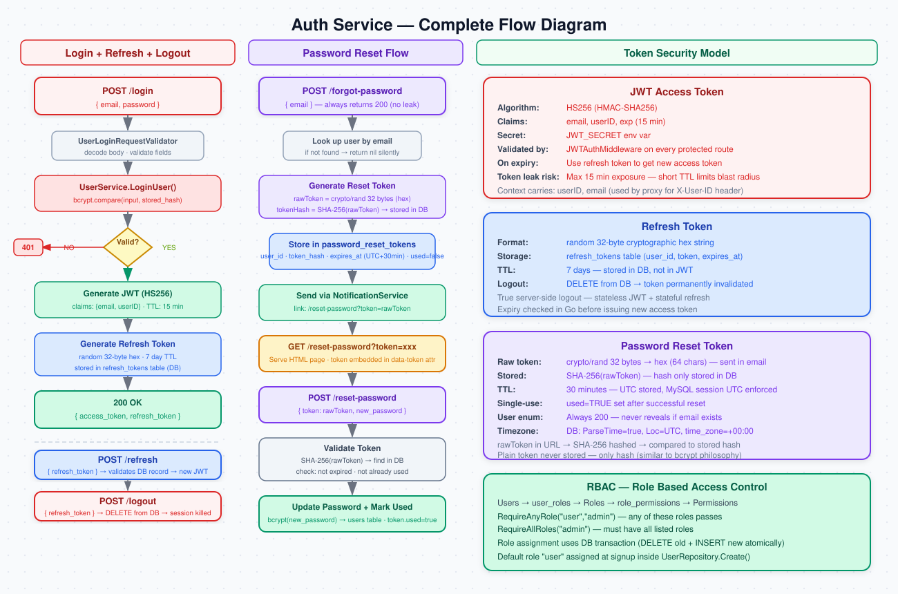
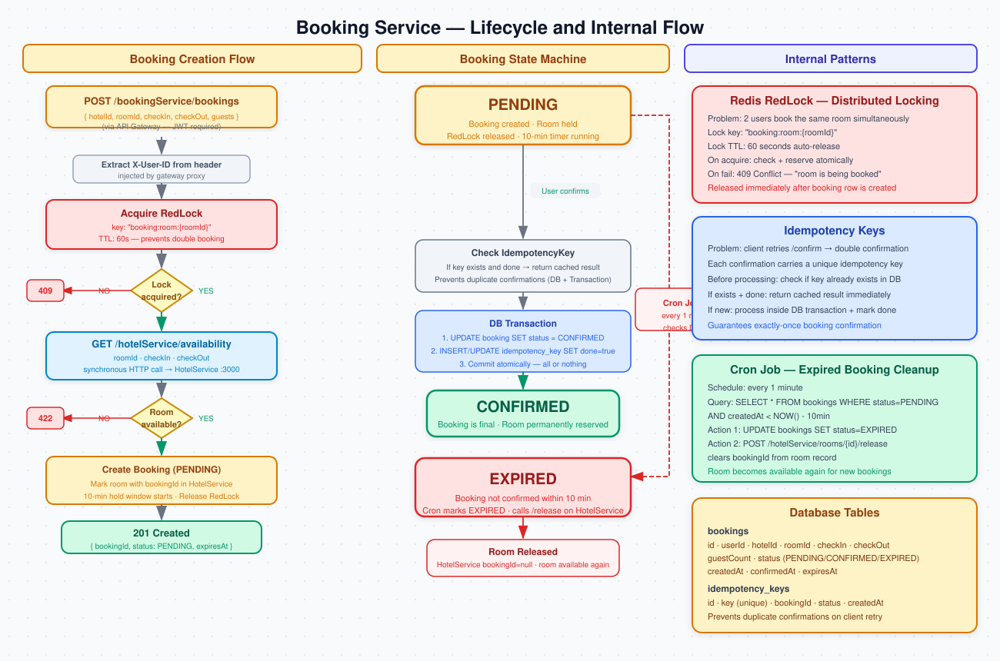
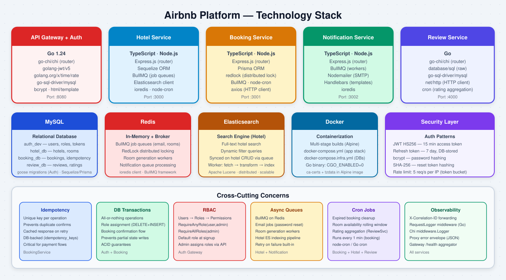

# Booking Platform Microservices – Platform Architecture Overview

This document provides an overview of the architecture and core functionality of our Airbnb-style microservices platform.

<p align="center">
  
</p>

---

## 1. API Gateway / Auth Service (Golang)

**Role:** The API Gateway serves as the **single entry point** for all incoming client requests. It is responsible for **authentication, authorization, intelligent routing, password management, and request lifecycle management**.

### Key Responsibilities

- **Centralized Authentication & Authorization**
  - Every inbound request must pass through the gateway before reaching any microservice.
  - Authentication is handled via **JWT tokens (HS256, 15-minute expiry)**.
  - **Role-Based Access Control (RBAC)** restricts route access based on user roles (`user` or `admin`), shielding internal services from unauthorized access.

- **Refresh Token & Server-Side Logout**
  - On login, a random 32-byte refresh token is issued alongside the JWT and stored in the `refresh_tokens` table (7-day expiry).
  - `POST /refresh` validates the stored token and issues a new access token without requiring re-login.
  - `POST /logout` deletes the refresh token from the DB — true server-side session invalidation. If the access token leaks, it expires in 15 minutes at most.

- **Password Reset Flow**
  - `POST /forgot-password` generates a single-use token (SHA-256 hashed, stored in `password_reset_tokens`, 30-minute expiry) and sends a reset link to the user's email via NotificationService. The response is always generic — the server never reveals whether the email exists (prevents user enumeration).
  - `GET /reset-password?token=<token>` serves a self-contained **HTML password reset page** with inline CSS and JavaScript. The form is only rendered when a valid token is present in the URL.
  - `POST /reset-password` validates the token hash, checks it is not expired or already used, updates the user's password (bcrypt), and marks the token as consumed.

- **Reverse Proxy**
  - Transparently forwards requests to downstream microservices after stripping the service namespace prefix.
  - Injects `X-User-ID` and `X-User-Email` headers so downstream services can apply per-user logic without re-validating the JWT.
  - Propagates `X-Correlation-ID` for distributed tracing across all services.
  - Gateway health check at `GET /health` pings all four downstream services in parallel and returns an aggregated status.

- **Rate Limiting**
  - IP-based token bucket limiter applied globally — **5 requests per second per IP** (`golang.org/x/time/rate`).
  - Supports testing via `X-Forwarded-For` header in Postman to simulate different IPs.

- **Inter-Service Communication**

  **I. Synchronous (REST over HTTP)**
  - All downstream service calls use standard HTTP/HTTPS REST APIs.

  **II. Asynchronous (Message-Based)**
  - **Message Queue** — AMQP-based brokers (RabbitMQ / AWS SQS). This platform uses **io-redis and BullMQ**.
  - **Publish/Subscribe** — Event-driven patterns (Apache Kafka, Redis Pub/Sub).

> **In essence:** The gateway functions as a **security checkpoint, traffic controller, password manager, and data aggregator** for the entire microservices ecosystem.

### Proxy Route Mapping

| Client Route | Upstream Service | Port | Auth Required |
|---|---|---|---|
| `/hotelService/*` | HotelService | `:3000` | user / admin |
| `/bookingService/*` | BookingService | `:3001` | user / admin |
| `/notificationService/*` | NotificationService | `:3002` | admin only |
| `/reviewService/*` | ReviewService | `:4000` | user / admin |
| `/health` | All (ping) | — | — |

<p align="center">
  
</p>

---

## 2. Booking Service (TypeScript)

**Role:** Manages the full hotel booking lifecycle and guarantees data consistency across the system.

### Core Logic

- Receives booking requests and validates **room availability** by making a synchronous REST API call to the HotelService.
- Employs **Redis + RedLock** for distributed locking, preventing race conditions where multiple users might attempt to book the same room simultaneously.
  ```
  await redlock.acquire([bookingResource], ttl);
  ```
  The lock is scoped to the `roomId` and held for up to 60 seconds before automatic release.
- New bookings are initially placed in a **pending state**.
- Upon booking creation, the room is marked with the `bookingId`, blocking other users from reserving it. This hold is valid for **10 minutes**. If the booking isn't confirmed within that window, a **cron job** (running every minute) detects expired pending bookings and:
  - Updates their status to `expired`.
  - Calls the HotelService's `/release` endpoint to free up the room for other users.
- Includes validation to ensure only the **original booking creator** can confirm the reservation.

### Booking Confirmation Flow

Confirmation uses **database transactions** to guarantee consistency:

1. Checks if the operation has already been processed using an **IdempotencyKey** (to prevent duplicate confirmations).
2. Updates the booking status to `CONFIRMED`.
3. Marks the IdempotencyKey as finalized.

### Key Database Tables

| Table | Purpose |
|---|---|
| `Booking` | Stores booking details — user, hotel, dates, guest count, and status. |
| `IdempotencyKey` | Prevents duplicate processing of booking or payment operations. |

<p align="center">
  
</p>

---

## 3. Hotel Service (TypeScript)

**Role:** Handles all hotel and room management operations.

### Key Features

1. **Hotel CRUD** — Full create, read, update, and delete support for hotel records.

2. **Room Management**
   - Check room availability for a specified date range.
   - Associate a `bookingId` with a room upon reservation.
   - Release rooms after booking expiration to eliminate ghost bookings.

3. **Room Generation & Scheduling**
   - Supports bulk room creation via **Redis queues and background workers**.
   - Scheduled cron jobs extend room availability to maintain a rolling booking window (e.g., 90 days ahead).

4. **Elasticsearch Integration**

   Elasticsearch is a distributed search and analytics engine built on Apache Lucene.

   - **Hotel Indexing:** When a hotel is created, its ID is queued in Redis → a worker fetches the details → transforms the data → indexes it in Elasticsearch. Create, update, and delete operations are kept in sync with MySQL.
   - **Hotel Search:** The `/search` route dynamically builds Elasticsearch queries using filters such as `id`, `name`, `address`, and `location`, then calls `esClient.search` and returns filtered results.

---

## 4. Notification Service (TypeScript)

**Role:** Handles outbound email notifications to users.

### How It Works

- When an email needs to be sent, a job is added to a **Redis queue** containing the recipient address, email template name, and template parameters.
- Background **worker processes** consume the queue and dispatch emails using **Nodemailer** with **Handlebars templates** for dynamic content rendering.

### Email Types

| Template | Trigger |
|---|---|
| `password-reset` | User calls `POST /forgot-password` — delivers a reset link valid for 30 minutes |

---

## 5. Review Service (Async Rating Calculation)

**Role:** Manages user reviews and drives hotel rating calculations.

### Workflow

- A **cron job** periodically aggregates newly submitted reviews to compute updated hotel ratings.
- Combines review records with **user profile data from AuthService** to produce enriched review responses.
- Pushes the **updated average rating** back to the HotelService.

> **Note:** All internal API calls between microservices are authenticated via the API Gateway using JWT tokens.

---

## 6. Cross-Cutting Concepts

| Concept | Description |
|---|---|
| **Idempotency** | Ensures that repeated booking or payment operations don't result in duplicates. |
| **Database Transactions** | Groups related operations so they succeed or fail together, preserving consistency. |
| **Redis + RedLock** | Distributed locking mechanism to handle concurrent access to shared resources. |
| **Cron Jobs** | Scheduled background tasks for room availability extension, expired booking cleanup, and rating recalculation. |
| **DTOs & Repositories** | Enforces a clean separation between layers for maintainable, testable code. |
| **Password Reset Tokens** | Single-use SHA-256 hashed tokens with 30-minute expiry stored in DB, preventing token reuse and user enumeration. |
| **UTC Timezone Enforcement** | MySQL session timezone pinned to `+00:00` on every connection; Go stores all times in UTC — prevents `expires_at > NOW()` comparison failures from timezone drift. |
| **Correlation ID Propagation** | `X-Correlation-ID` header forwarded through all service hops for distributed trace linking. |

---

## 7. Tech Stack & Design Choices

| Layer | Technology | Reason |
|---|---|---|
| API Gateway + Auth | Golang | High concurrency, strong typing, minimal overhead |
| Microservices | Node.js + TypeScript | Expressive, typed business logic |
| ORM / Database | Sequelize, Prisma + MySQL | Flexible data access patterns |
| Raw DB (Auth) | `database/sql` (no ORM) | Full SQL control, no abstraction overhead |
| Async Jobs | Redis + BullMQ | Reliable background processing and email delivery |
| Search | Elasticsearch | Full-text hotel search with dynamic filters |
| Security | JWT HS256 + RBAC | Stateless auth with fine-grained role-based access |
| Session Management | Refresh tokens in DB | Server-side logout and token revocation |
| Password Reset | SHA-256 hashed tokens + HTML UI | Secure, single-use, served directly from auth service |
| Rate Limiting | `golang.org/x/time/rate` (token bucket) | 5 req/sec per IP — abuse prevention |
| Containerization | Docker (multi-stage, Alpine) | Minimal image size, production-ready |

<p align="center">
  
</p>

---

## Summary

This platform is built to be **secure, scalable, and maintainable**. The **API Gateway** centralizes authentication, routing, and request management, while each microservice remains focused on a single domain responsibility — ensuring clean boundaries, independent deployability, and long-term system health.
